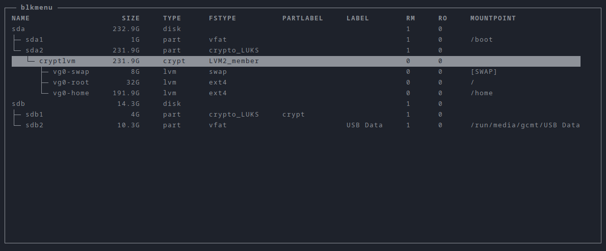

Based on https://github.com/SL-RU/ranger_udisk_menu and https://github.com/gcmt/blkmenu

# Ranger blkmenu
This script draws menu to mount and unmount partitions using udisksctl and ncurses



# Requirements
- python3.8 or newer
- udisks2 (for udisksctl)
- lsblk 2.3 or newer

# How to install
Firstly you need to clone this repo to the plugins directory of ranger

```Bash
cd ~/.config/ranger/plugins
git clone https://github.com/av-gantimurov/ranger_blkmenu
```

Then you need to add to `~/.config/ranger/commands.py` line:

```Python3
from plugins.ranger_blkmenu.mounter import mount
```

Thats all

# How to use
Enter in ranger `:mount`, than will be shown menu. In this menu you can press:

| Key | Action | Descriptiption |
| --- | ------ | -------------- |
| `q` | quit | Exit the program |
| `j`, `KEY_DOWN` | movedown | Move down a line |
| `k`, `KEY_UP` | moveup | Move up a line |
| `m` | mount | Mount the selected device |
| `u` | unmount | Unmount the selected device |
| `l` | lock | Lock the selected device |
| `L` | unlock | Unlock the selected device |
| `e` | eject | Eject the selected device |
| `o` | mount,open | Mount the selected device; Open the selected device mountpoint |
| `KEY_ENTER` | open | Open the selected device mountpoint |
| `i` | info | Display all device properties |
| `r` | refresh | Refresh the device tree |
| `a` | toggle_filter | Toggle active filters |
| `?` | help | Display this help screen |

# Troubles

If there is trouble with permissions, then you need to create group `storage` and add your user to it. Then you need to update your Polkit or PolicyKit permissions like it shown [here: https://github.com/coldfix/udiskie/wiki/Permissions](https://github.com/coldfix/udiskie/wiki/Permissions)
